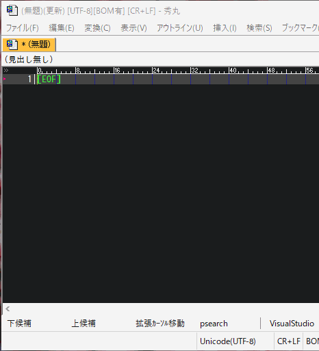

# command-line

秀丸エディタのコマンドライン（作成中）

# スクリーンショット

# 機能

- 秀丸マクロの命令(insert,up,messageなど)を呼び出せます。
- 先頭に!を付けるとコマンドラインとして解釈します。(!dir, !set とか)
- マクロを呼び出せます。（スクリーンショットでは[IKKI氏](http://mobitan.org/)作成の[varren3.mac](http://mobitan.org/hm/varren3/)を呼び出しています。）

# コマンドラインの操作方法

Bashと概ね同じです。

## カーソル移動

|機能|ショートカットキー|補足|
|:--:|:--:|:--:|
|左右移動|Left Right Ctrl-f Ctrl-b||
|行頭に移動|Ctrl-a||
|行末に移動|Ctrl-e||
|前の単語に移動|Alt-b|inputchar関数がAltキーを認識しないため動作しない|
|次の単語に移動|Alt-f|inputchar関数がAltキーを認識しないため動作しない|

## 文字削除

|機能|ショートカットキー|補足|
|:--:|:--:|:--:|
|直前の一文字を削除|Backspace||
|直後の一文字を削除|Ctrl-d Ctrl+Backspace||
|直前の一単語を削除|Ctrl-w||
|直後の一単語を削除|Alt-d|inputchar関数がAltキーを認識しないため動作しない|
|カーソル以前の文字を削除|Ctrl-u||
|カーソル以降の文字を削除|Ctrl-k||
|全削除|Ctrl-N||

## 履歴

|機能|ショートカットキー|補足|
|:--:|:--:|:--:|
|前の履歴|Ctrl-p|これから実装|
|履歴を後方に遡ってインクリメンタルサーチ|Ctrl-r|これから実装|

## コマンド実行

|機能|ショートカットキー|補足|
|:--:|:--:|:--:|
|Exit|ESC Ctrl-c||
|コマンド実行|Ctrl-j Ctrl-m Enter||

## その他編集

|機能|ショートカットキー|補足|
|:--:|:--:|:--:|
|直前の文字とその前の文字を入れ替える|Ctrl-t||

# その他

- VIMに触発されてなんとなく作ってみましたが、補完が効かないので微妙に使いにくいです。
- 他のマクロに組み込んで使うことを目的として開発しています。

# 連絡先

<https://ohtorii.hatenadiary.jp/>  
<https://twitter.com/ohtorii>  
<https://github.com/ohtorii>